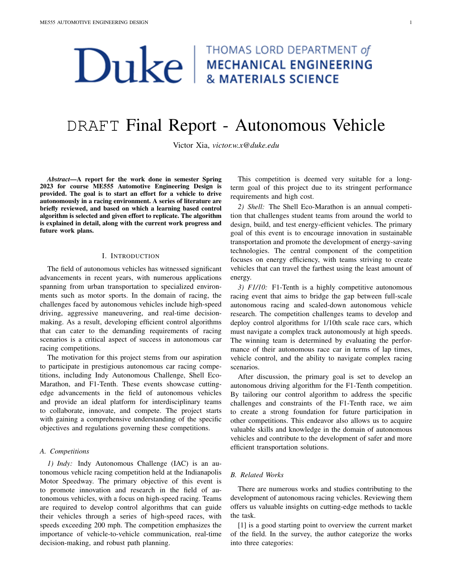
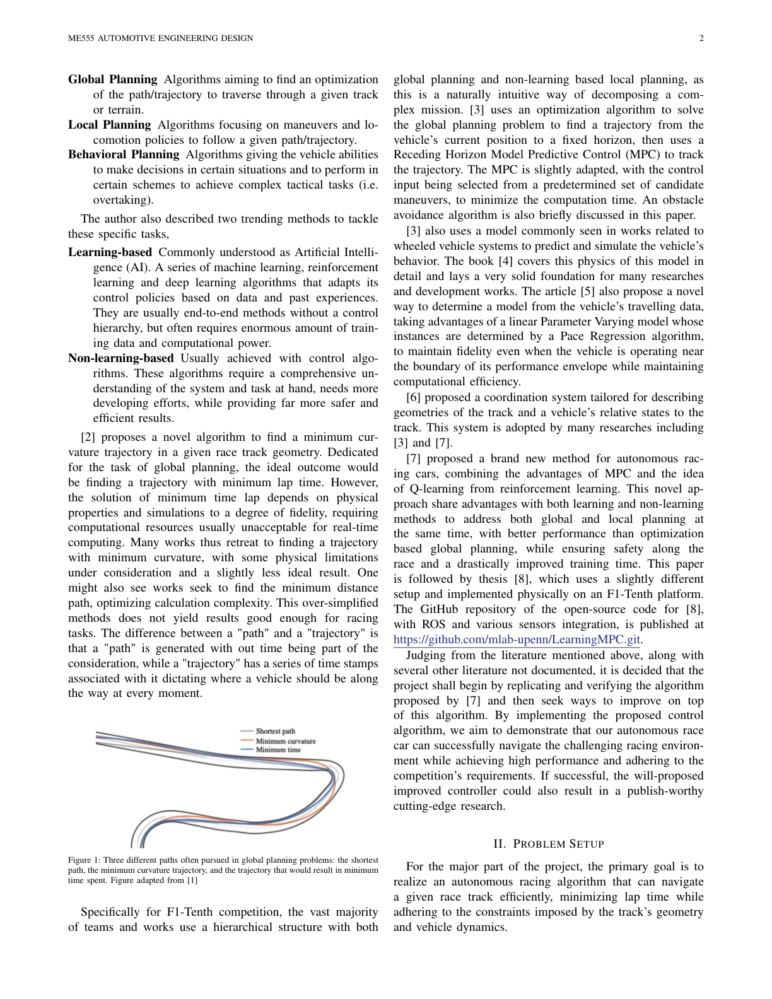
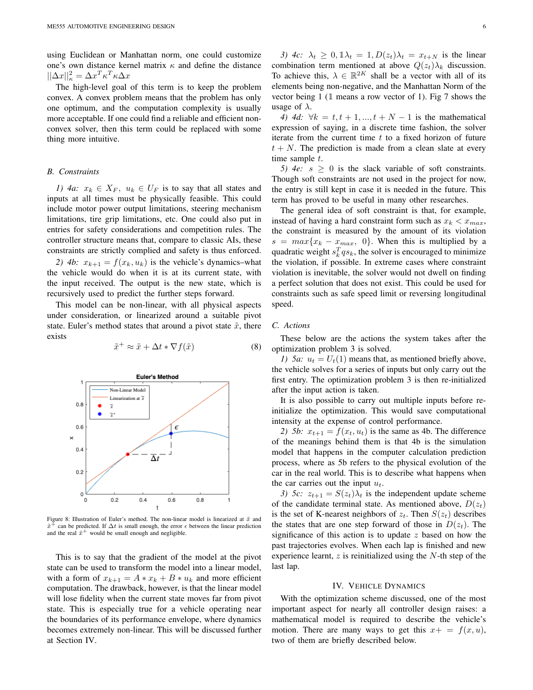
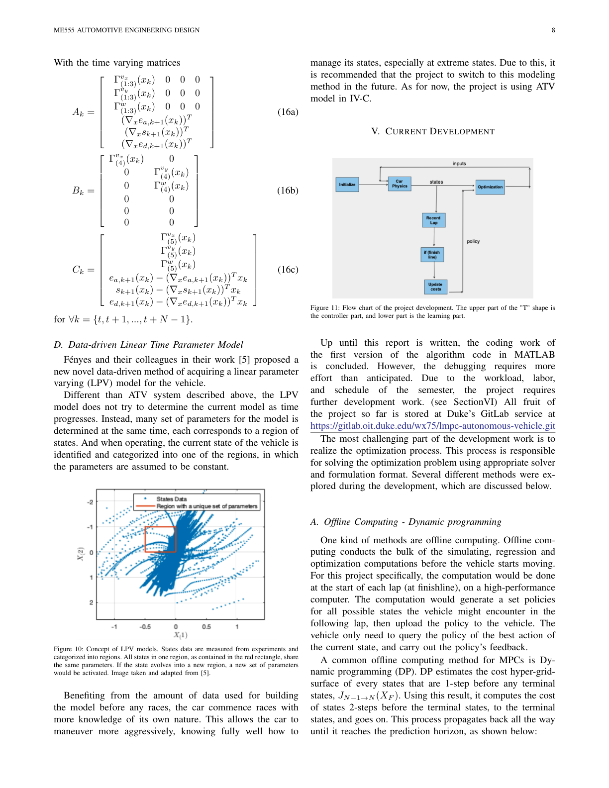
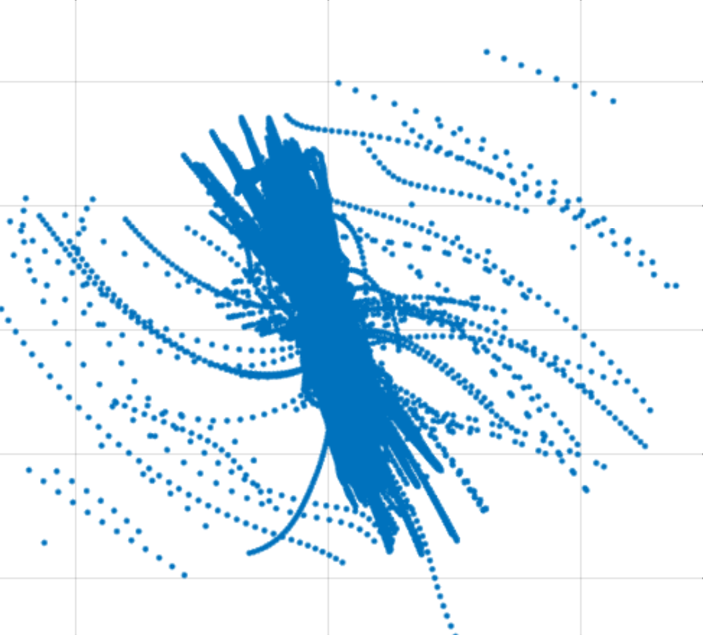

# LMPC autonomous racing — portfolio repository

MATLAB research code and final report for **learning-informed MPC / autonomous mini-car racing** on a spline-defined track. This layout is optimized for **PhD application review**: a single Git tree, a clear PDF path, and rasterized report pages for quick visual scanning on GitHub or GitLab.

## Report (primary artifact)

- **PDF**: [`docs/report/VXia_FinalReport.pdf`](docs/report/VXia_FinalReport.pdf)

On GitHub, open the file in the browser for inline preview, or use *View raw* for a direct download link to share with reviewers.

## Repository map

| Path | Contents |
|------|----------|
| [`docs/report/`](docs/report/) | Final report PDF |
| [`docs/figures/`](docs/figures/) | `LPV.png` plus exported report pages (`report_p*.png`) |
| [`docs/PORTFOLIO.md`](docs/PORTFOLIO.md) | Short English summary for reviewers |
| [`docs/MATERIALS_OUTSIDE_REPO.md`](docs/MATERIALS_OUTSIDE_REPO.md) | What was moved out of Git (third-party + PDF library) |
| [`src/matlab/`](src/matlab/) | Core `.m` sources and `CANONICAL.md` deduplication notes |
| [`src/live_scripts/`](src/live_scripts/) | `.mlx` drivers (`Launch.mlx`, visualization, tests) |
| [`data/`](data/) | `track.mat` (committed); `lambdas.mat` **ignored** (large) |
| [`literature/`](literature/) | Link-only reading list |
| [`archive/`](archive/) | Syllabus, Pages notes, autosave copies (see sub-READMEs) |
| [`scripts/`](scripts/) | Optional `export_report_figures.py` helper |

## Key figures

### Report (rasterized pages)

<p align="center">


</p>

<p align="center">


</p>

### Project figure

<p align="center">

</p>

## How to read the code

1. Read the PDF under `docs/report/`.
2. In MATLAB, start from [`src/live_scripts/Launch.mlx`](src/live_scripts/Launch.mlx) if that matches your original workflow.
3. Follow `initializeRace.m` → `solveLMPC.m` in [`src/matlab/`](src/matlab/) (see [`src/matlab/README.md`](src/matlab/README.md)).

## Reproducibility

- MATLAB with Live Editor (`.mlx`).
- `data/track.mat` is included; **`data/lambdas.mat` is not** (see [`data/README.md`](data/README.md)). Restore it from your private backup when needed.
- Third-party simulators and full reference codebases are **not** in this repo; see [`docs/MATERIALS_OUTSIDE_REPO.md`](docs/MATERIALS_OUTSIDE_REPO.md).

## References

Curated **link-only** list: [`literature/README.md`](literature/README.md).

## License / third-party

Code in `src/` is author research code unless noted in file headers. Third-party distributions that previously lived beside this tree (ADVISOR, BARC, etc.) remain under their upstream licenses in your local backup folder, not in Git.

## Publishing this repository

```bash
cd /path/to/RLMPC
git remote add origin <your-git-host-url>
git branch -M main
git push -u origin main
```

Use a **private** remote if any part of the narrative or code is not yet public. After the first push, share the repository URL and the path to `docs/report/VXia_FinalReport.pdf` as your report link.
