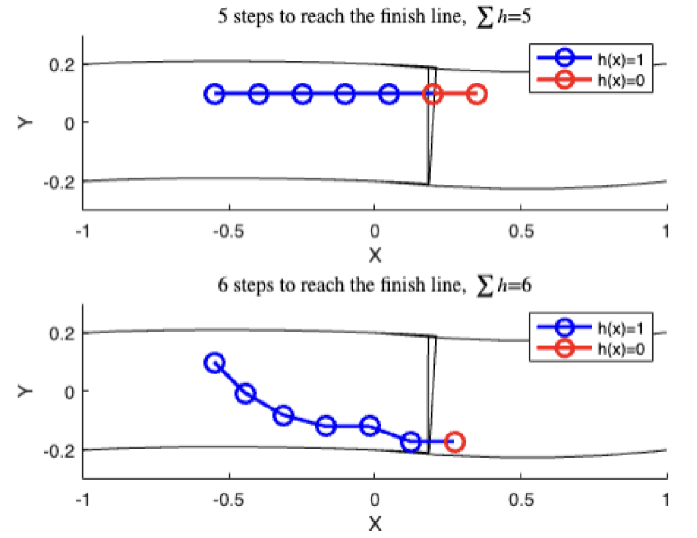
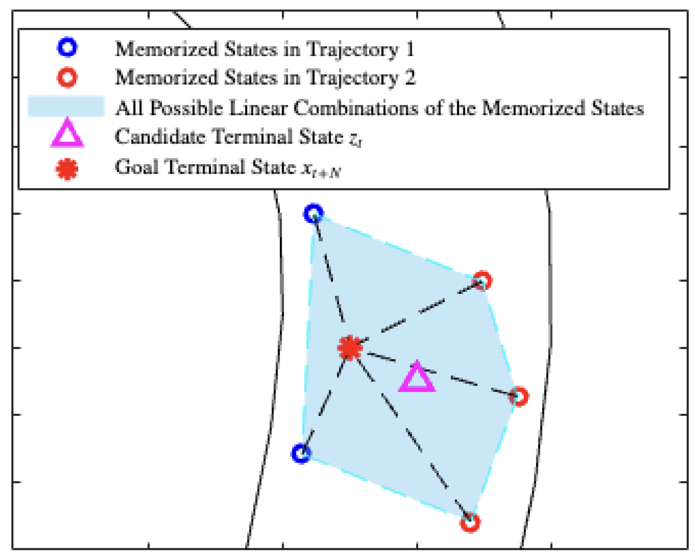
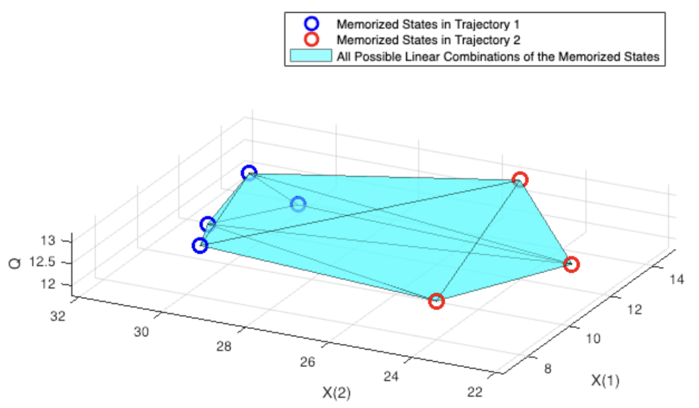
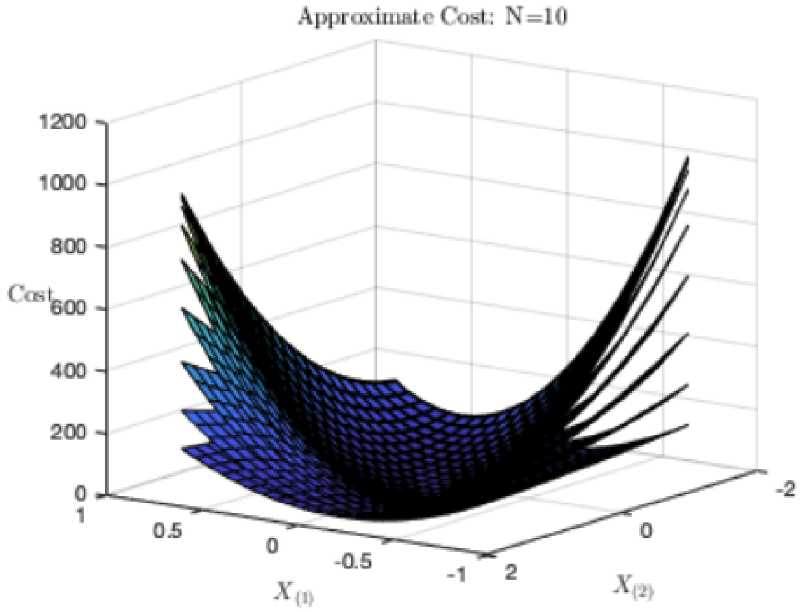

# RL Assisted MPC for F1TENTH autonomous racing

>This repo archieves code and artifacts, along with writings, of a learning-assisted MPC trajectory planner and controller for autonomous F1TENTH mini-car racing. I completed in 2023 at Duke University Thomas Lord Department of Mechanical Engineering And Material Science.

## Report (primary artifact)

- **Full report**: [`docs/report/VXia_FinalReport.pdf`](docs/report/VXia_FinalReport.pdf)

On GitHub, open the file in the browser for inline preview, or use *View raw* for a direct download link to share with reviewers.

## Repository map

| Path | Contents |
|------|----------|
| [`docs/report/`](docs/report/) | Final report PDF |
| [`src/matlab/`](src/matlab/) | Core `.m` sources and `CANONICAL.md` deduplication notes |
| [`src/live_scripts/`](src/live_scripts/) | `.mlx` drivers (`Launch.mlx`, visualization, tests) |
| [`data/`](data/) | `track.mat`; `lambdas.mat` |

## Key Figures

Race Progress

Q-value From Last Lap Trajectory

Interpolation of Current Q-value

MPC Quadratic Cost Field

